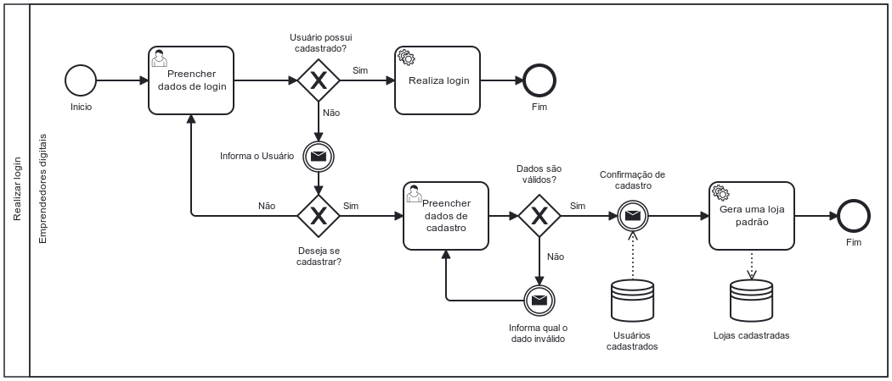

### 3.3.1 Processo 1 – REALIZAR LOGIN

_Realizar Login. Este processo envolve a autenticação do usuário na plataforma. As oportunidades de melhoria para este processo podem incluir a otimização do tempo de login, aprimoramento da interface do usuário para facilitar a entrada de dados, e a implementação de verificações de segurança mais robustas.._

#### Detalhamento das atividades

_Detalhamento das atividades As atividades do processo de cadastro de novos usuários na UiHub:_

_\* **Início** - O usuário acessa a página de login._

_\* **Preencher dados de login** - O usuário preenche os campos necessários._

_\* **Usuário possui cadastro?** - O sistema verifica se o usuário possui cadastro._

_\* **Informa Usuário** - O sistema informa o usuário se os dados estão incorretos._

_\* **Realiza login** - O sistema realiza o login do usuário caso o usuário seja cadastrado e tenha preenchido dados válidos._

_\* **Deseja se cadastrar?** - O usuário toma decisão por conta própria se deseja se cadastrar ou não._

_\* **Acessar página de cadastro** - O usuário clica no link da página de login que direciona para a página de cadastro._

_\* **Preencher dados de cadastro** - O usuário preenche os campos necessários para realizar o cadastro._

_\* **Dados são válidos?** - O sistema verifica se os dados inseridos no formulário de cadastro são dados válidos._

_\* **Informa qual o dado inválido** - O sistema informa o usuário qual dos dados inseridos é inválido._

_\* **Confirmação de cadastro** - O sistema informa o usuário que o usuário foi criado com sucesso._

_\* **Gera uma loja padrão** - O sistema gera automaticamente uma loja padrão associada ao usuário._

_\* **Fim** - Fim do processo._

_Os tipos de dados a serem utilizados são:_

\* **Caixa de texto** - campo texto de uma linha

**Preecher dados de login**

| **Campo**          | **Tipo**       | **Restrições**                                       | **Valor default** |
| ------------------ | -------------- | ---------------------------------------------------- | ----------------- |
| Endereço de e-mail | Caixa de Texto | Formato de e-mail, ser um e-mail que possua cadastro |                   |
| Senha              | Caixa de Texto | Ser uma senha válida associada ao e-mail             |                   |

| **Comandos**                      | **Destino**                            | **Tipo** |
| --------------------------------- | -------------------------------------- | -------- |
| Login                             | Painel de Controle, fim do processo 01 | default  |
| Ainda não tem conta? Cadastre-se! | Página de Cadastro                     |          |

**Preencher dados de cadastro**

| **Campo**        | **Tipo**       | **Restrições**                                         | **Valor default** |
| ---------------- | -------------- | ------------------------------------------------------ | ----------------- |
| Nome             | Caixa de Texto |                                                        |                   |
| Sobrenome        | Caixa de Texto |                                                        |                   |
| Email            | Caixa de Texto | Formato de e-mail e não estar em uso por outro usuário |                   |
| Senha            | Caixa de Texto | Ser uma senha válida                                   |                   |
| Confirme a Senha | Caixa de Texto | Ser identida a senha digitada no campo senha           |                   |

| **Comandos**                      | **Destino**                            | **Tipo** |
| --------------------------------- | -------------------------------------- | -------- |
| Criar Conta                       | Painel De Controle, fim do processo 01 | default  |
| Já tem uma conta? Vá para o login | Página de Login                        |          |
