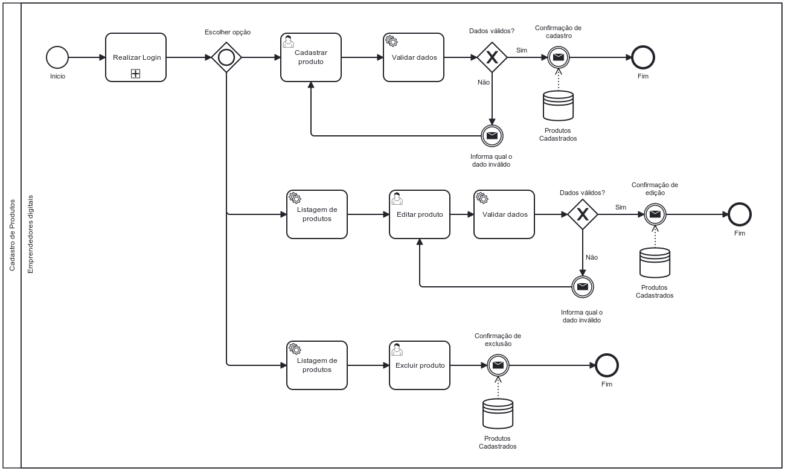

### 3.3.2 Processo 2 – CADASTRO DE NOVOS PRODUTOS

_Cadastro de Novos Produtos. Algumas das oportunidades de melhoria para este processo podem incluir a otimização do tempo de cadastro, aprimoramento da interface do usuário para facilitar a entrada de dados, e a implementação de verificações de segurança mais robustas._

#### Detalhamento das atividades

_Detalhamento das atividades do processo de cadastro de novos produtos na UiHubU:_

_\* **Escolha da atividade** - O usuário escolhe se desejaa cadastrar, editar ou excluir um produto._

_\* **Validação** - A Uihub valida o cadastro e/ou a edição do produto._

_\* **Exclusão do produto** -O usuário escolhe a opção de excluir produto._ 

_\* **Exibição de Mensagem de Sucesso** - A UiHubU exibe uma mensagem de sucesso no cadastro, edição ou exclusão de um novo produto._

_Os tipos de dados a serem utilizados são:_

_\* **Caixa de texto** - campo texto de uma linha_

_\* **Data** - campo do tipo data (dd-mm-aaaa)_

_\* **Número** - campo numérico_

_\* **Seleção múltipla** - campo com várias opções que podem ser selecionadas mutuamente (tradicional checkbox ou listbox)_

_\* **Link** - campo que armazena uma URL_=

**Preencher as informações do produto a ser cadastrado**

| **Campo**                | **Tipo**       | **Restrições**                | **Valor default** |
| ------------------------ | -------------- | ----------------------------- | ----------------- |
| nome do produto          | Caixa de Texto |      máx 20 caracters         |                   |
| descrição do produto     | Caixa de Texto |      máx 150 caracteres       |                   |
| preço do produto         | Número         |       máx 6 dígitos           |                   |
| link para foto do produto| Link           |     formato link              |                   |
| categoria do produto     | Seleção Múltipla |                             |                   |

| **Comandos** | **Destino**                    | **Tipo** |
| ------------ | ------------------------------ | -------- |
| voltar       | Acessar a UiHubU               | cancel   |
| salvar       | Salvar os dados do produto a ser cadastrado | default  |

**Preencher as informações do produto a ser editado**

| **Campo**                | **Tipo**       | **Restrições**                | **Valor default** |
| ------------------------ | -------------- | ----------------------------- | ----------------- |
| nome do produto          | Caixa de Texto |      máx 20 caracters         |                   |
| descrição do produto     | Caixa de Texto |      máx 150 caracteres       |                   |
| preço do produto         | Número         |       máx 6 dígitos           |                   |
| link para foto do produto| Link           |     formato link              |                   |
| categoria do produto     | Seleção Múltipla |                             |                   |

| **Comandos** | **Destino**                    | **Tipo** |
| ------------ | ------------------------------ | -------- |
| voltar       | Acessar a UiHubU               | cancel   |
| salvar       | Salvar os dados do produto a ser editado | default  |

**Selecionar produto a ser excluido**

| **Campo**                | **Tipo**       | **Restrições**                | **Valor default** |
| ------------------------ | -------------- | ----------------------------- | ----------------- |
| nome do produto          | Caixa de Texto |      máx 20 caracters         |                   |
| descrição do produto     | Caixa de Texto |      máx 150 caracteres       |                   |
| preço do produto         | Número         |       máx 6 dígitos           |                   |
| link para foto do produto| Link           |     formato link              |                   |
| categoria do produto     | Seleção Múltipla |                             |                   |

| **Comandos** | **Destino**                    | **Tipo** |
| ------------ | ------------------------------ | -------- |
| voltar       | Acessar a UiHubU               | cancel   |
| excluir      | Exclui o produto               | default  |
