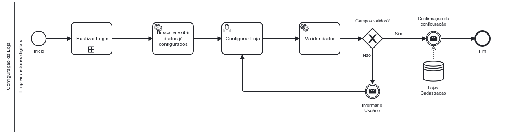

### 3.3.3 Processo 3 – CONFIGURAÇÃO DA LOJA

_Configuração da Loja. Algumas das oportunidades de melhoria para este processo podem incluir a otimização do tempo de personalização, aprimoramento da interface do usuário para facilitar a entrada de dados, e a implementação de verificações de segurança mais robustas._

#### Detalhamento das atividades

_Detalhamento das atividades As atividades do processo de personalização da loja na UiHub:_

_\* **Início** - O usuário acessa a página de login na UiHub._

_\* **Configurar Loja** - O usuário acessa a página de configuração de loja e preenche e atualiza os dados da loja._

_\* **Válidar Campos** - O sistema válida se os dados preenchidos em cada campo é válido._

_\* **Campos são Válidos?** - O sistema verifica se os campos são válidos._

_\* **Informar o Usuário** - O sistema informa o usuário caso não seja válido algum dos dados preenchidos._

_\* **Confirmação de Configuração** - O sistema confirma a nova configuração da loja._

_\* **Fim** - Fim do processo._

_Os tipos de dados a serem utilizados são:_

_\* **Área de texto** - Campo texto de múltiplas linhas_

_\* **Link** - Campo que armazena uma URL_

_\* **Input Color** - Campo com seletor de cores_

**Realizar Login**

| **Campo**          | **Tipo**       | **Restrições**                                       | **Valor default** |
| ------------------ | -------------- | ---------------------------------------------------- | ----------------- |
| Endereço de e-mail | Caixa de Texto | Formato de e-mail, ser um e-mail que possua cadastro |                   |
| Senha              | Caixa de Texto | Ser uma senha válida associada ao e-mail             |                   |

| **Comandos**                      | **Destino**                            | **Tipo** |
| --------------------------------- | -------------------------------------- | -------- |
| Login                             | Painel de Controle, fim do processo 01 | default  |
| Ainda não tem conta? Cadastre-se! | Página de Cadastro                     |          |

**Configurar Loja**

| **Campo**              | **Tipo**         | **Restrições** | **Valor default** |
| ---------------------- | ---------------- | -------------- | ----------------- |
| Nome da Loja           | Caixa de Texto   |                |                   |
| Link Da Foto De Banner | Link             |                |                   |
| Cor da Página          | Seleção Múltipla |                |                   |
| Cor do Menu            | Seleção Múltipla |                |                   |
| Cor do Texto do Menu   | Seleção Múltipla |                |                   |

| **Comandos**  | **Destino**                                                     | **Tipo** |
| ------------- | --------------------------------------------------------------- | -------- |
| Salvar Edição | Salvar os novos dados da configuração da loja do usuário logado | default  |
